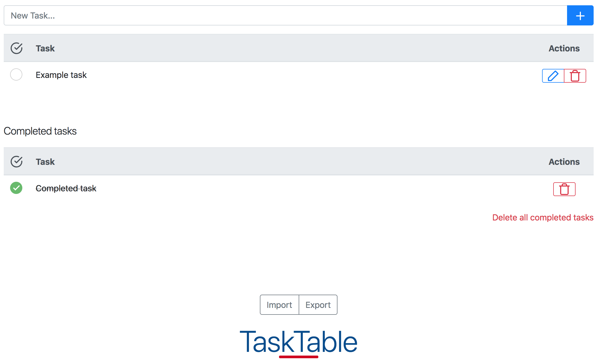

# TaskTable

[Go to TaskTable](https://leoneck.github.io/TaskTable/)

Screenshot:

TaskTable stores all data in the users browser. This means the data *should* be persistent between reloads. There are still scenarios where the data might be deleted. For example if all data for the site is cleared or if the user is accessing it through a private browsing window. There is an import / export functionality to exchange data between browsers and devices.